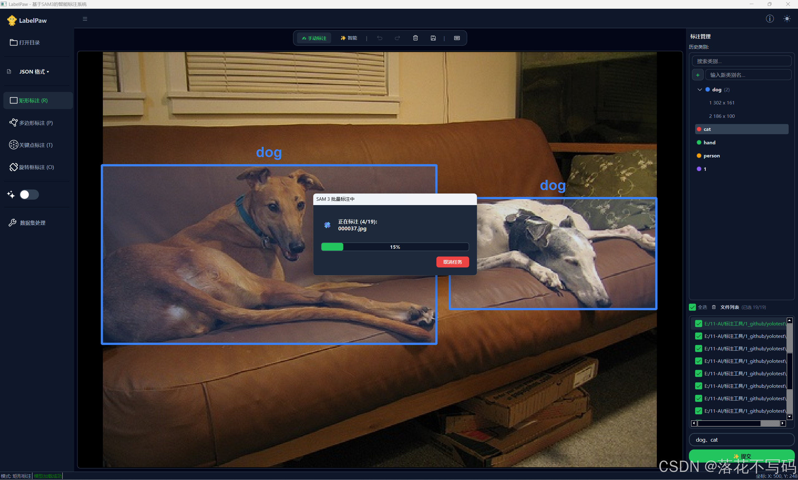
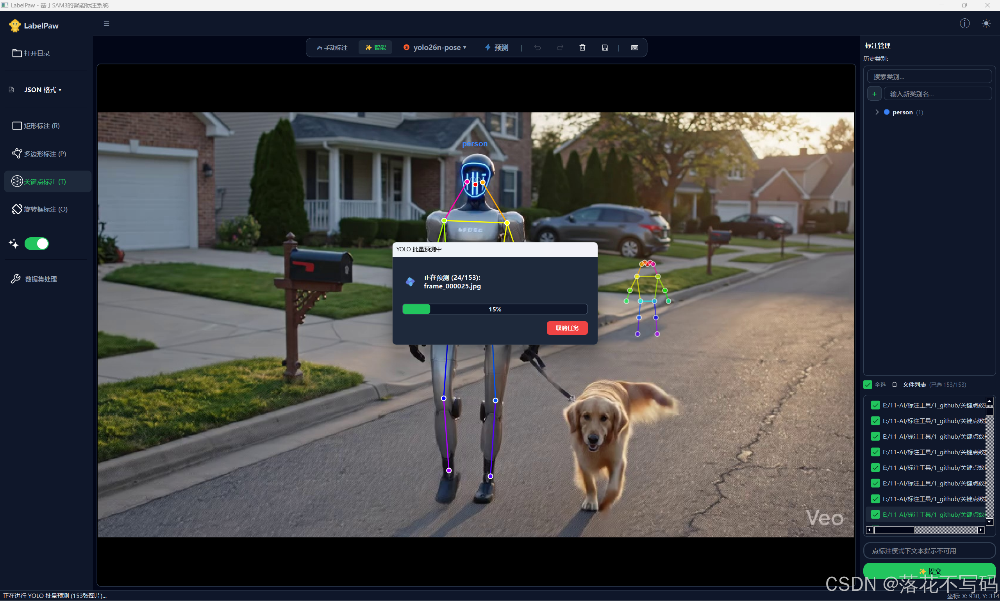
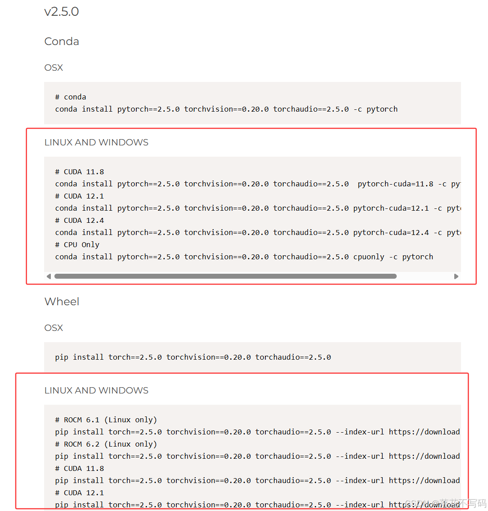
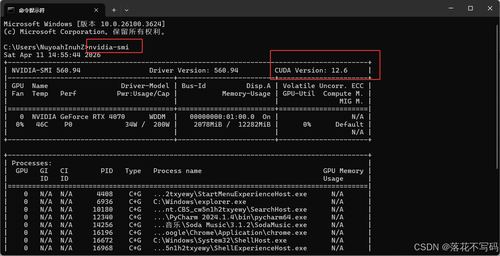
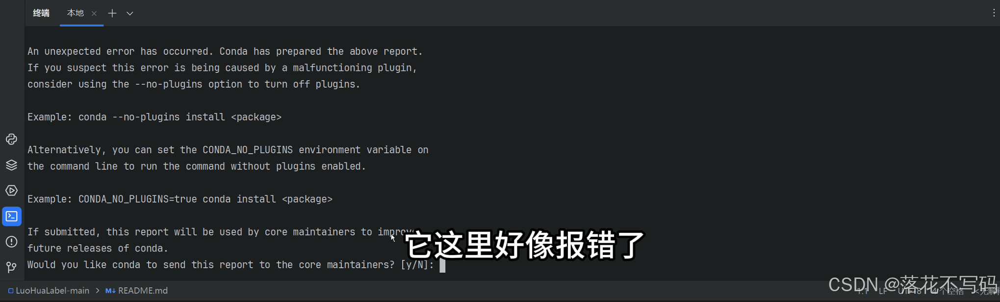
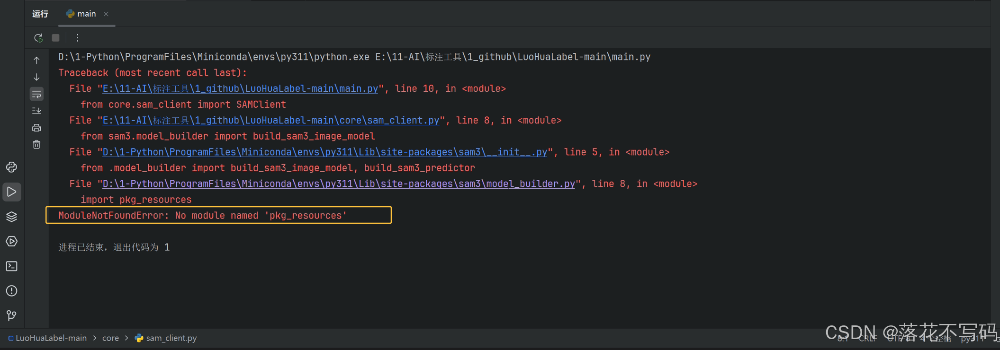
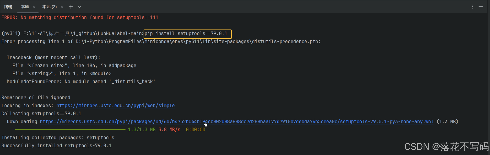
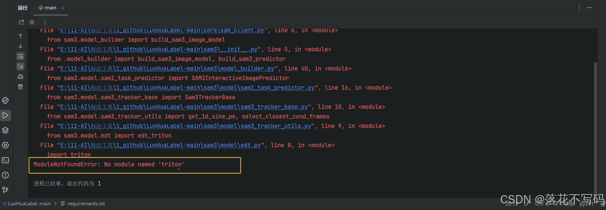
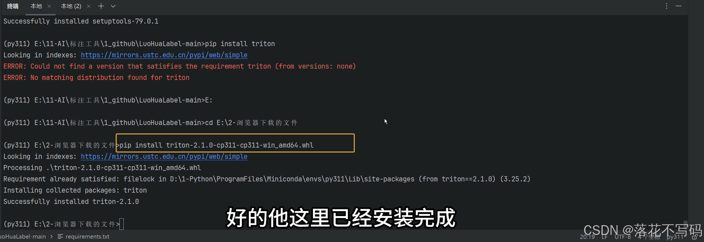

<div align="center">
  <p>
    <a href="https://github.com/luohuabuxiema/LabelPaw" target="_blank">
      </a>
  </p>
  <a href="README.md">English</a> | <a href="README_zh-CN.md">简体中文</a>
</div>


# LabelPaw - Intelligent Image Annotation System (v2.0.0)
## Foreword
Due to the project's need for dataset annotation, I previously used tools like labelme and labelimg. Therefore, I decided to combine excellent computer vision models such as SAM2, SAM3, and YOLO pose estimation to develop a smarter and more efficient annotation tool. After multiple iterations, the system has welcomed its brand-new **v2.0.0 release**!

Source Code Repository: [https://github.com/luohuabuxiema/LabelPaw](https://github.com/luohuabuxiema/LabelPaw)

## Changelog

- **2026-05-28**: Added SAM 3 batch intelligent annotation, multi-prompt annotation support, and YOLO batch prediction annotation. Integrated new features including delete and multi-select checkbox buttons in the file list panel, along with other comprehensive UI optimizations.
- **2026-05-27**: Removed the class selection dialog and unified class modification and creation within the right-side category history panel. Optimized operations including deleting and hiding specified target boxes in the category tree view.
- **2026-05-15**: Added keypoint skeleton templates for human faces, hands, and pedestrians. Supports customizing keypoint templates and connectivity lines.
- **2026-05-14**: Added the SAM2.1 model for intelligent point-click annotation, and integrated the Ultralytics YOLO model. The YOLO model can be used for intelligent annotation of rectangles, segmentations, keypoints, and OBB (Oriented Bounding Boxes).
- **2026-05-13**: Perfected reciprocal format conversion for JSON/XML/YOLO, supported JSON to U-Net Mask generation, and one-click random dataset splitting.
- **2026-05-10**: Added support for Light and Dark theme modes, providing a more comfortable visual experience.
- **2026-04-12**: Built the PySide6-based foundational intelligent annotation interface (First Release).
- **2026-04-10**: Integrated the next-generation SAM3, supporting hover preview, single-point rapid contour extraction, and text prompt-based full-image target auto-segmentation.
- **2026-04-09**: Supported Rectangle (Rect), Polygon (Poly), and Point annotation, along with the original OBB rotated box control handle (supporting 360° seamless smooth rotation and slide-to-wall detection).
- **2026-04-08**: Supported native saving of JSON, YOLO (.txt), and XML (Pascal VOC).


## System Introduction

The system is built based on PySide6 and integrates the **SAM2**, **SAM3**, and **Ultralytics YOLO** vision models, which significantly enhances annotation efficiency:
- **Intelligent Point-Click & Prompt Segmentation**: When SAM intelligent annotation is enabled, it supports rapid target extraction in polygon, rectangle, and OBB modes.
- **Keypoint Skeleton Templates & Intelligent Annotation**: A brand-new keypoint module with built-in templates for pedestrians, hands, faces, etc. You can customize keypoint templates for quick annotation, and optionally use the YOLO model for intelligent keypoint detection and automatic connection.

| Feature             | Interface Demonstration                                                     |
| ---------------- | ------------------------------------------------------------ |
| SAM 3 Batch Annotation     |  |
| YOLO Model Batch Prediction |  |
| Keypoint Annotation       |  |
| OBB Intelligent Annotation      |  |
| Rectangle Intelligent Annotation     |  |
| Keypoint Intelligent Annotation   |  |
| Hand Keypoint Template   |  |
| Built-in Keypoint Templates   |  |
| Face Keypoint Template   |  |
| Hand Keypoint Template   |  |
| Custom Keypoint Template |  |
| Dataset Processing Tool   |  |


## 🙊 Core Features

- **✨ AI Intelligent Assistance (SAM2/SAM3 Driven)**: Hover preview, single-point rapid contour extraction, and text prompt-based full-image target auto-segmentation.
- **🦴 Keypoint Skeleton Templates & Intelligent Annotation (YOLO Driven)**: Supports intelligent annotation for rectangles, segmentations, OBB, and keypoints. Keypoints feature built-in pedestrian (17 points), face (68 points), and hand (21 points) templates. Keypoint annotation supports custom skeleton templates.
- **📐 All-round Annotation Modes**: Rectangle (Rect), Polygon (Poly), Point, OBB rotated box, and Keypoint (Pose).
- **🔄 Ultimate OBB Interaction**: Rotated box control handle with 360° stepless smooth rotation and slide-to-wall detection.
- **💾 Multi-Format Conversion & Export**: Native support for saving JSON, YOLO (.txt), and XML (Pascal VOC), and one-click generation of U-Net Masks.
- **🗄️ Dataset Processing Workflow**: Supports train/val/test set random splitting by custom proportions.

---

## 🛠️ Deployment & Execution Environment

### 1. Basic Environment Dependencies

Python 3.10+ is recommended.

Create a virtual environment with the following command:

```bash
conda create -n py311 python==3.11.5
```
Activate the newly created virtual environment:

```bash
conda activate py311 
```


First, install the necessary PyTorch dependency:

Install `torch>=2.5.0` separately. PyTorch official website: [https://pytorch.org/](https://pytorch.org/get-started/previous-versions/?_gl=1*r08hqw*_up*MQ..*_ga*MTg1ODQzMTE5LjE3NzU4ODk5NDI.*_ga_469Y0W5V62*czE3NzU4ODk5NDEkajYwJGwwJGgw/)


**💡 PyTorch Installation Guidelines (Must-read for beginners)**

Please verify the following key points before installing PyTorch to avoid post-installation runtime errors:

**1. Confirm Graphics Card Support and CUDA Version (Extremely Important)**
* **Applicable OS**: This tutorial is based on the Windows environment.
* **How to Check**: Press `Win + R` keys, type `cmd` to open the command prompt, type `nvidia-smi`, and press Enter. In the top right corner of the displayed table, find the **CUDA Version**.


* **Version Matching Requirement**: The PyTorch CUDA version you download (such as `cu118` or `cu121` in the command) **must be less than or equal to** the CUDA Version shown on your computer. If your computer does not have a dedicated NVIDIA GPU, or if you cannot find this info, please choose the **CPU version** command from the official website.


**2. Choose either Conda or Pip Command**

Install the specified version based on your computer. If the `conda` command gets stuck, you can try configuring domestic mirrors (Tsinghua/USTC) in the terminal first, and then remove `-c pytorch -c nvidia` at the end of the command (since `-c` forces the download from official foreign channels):

```bash
conda install pytorch==2.5.0 torchvision==0.20.0 torchaudio==2.5.0  pytorch-cuda=11.8 -c pytorch -c nvidia
```

The above command usually fails to install in most cases. Therefore, it is highly recommended to use the Alibaba Cloud wheels mirror. The `whl` packages for PyTorch GPU can be viewed at: [https://mirrors.aliyun.com/pytorch-wheels/](https://mirrors.aliyun.com/pytorch-wheels/)

The `cu` version at the end must correspond to your CUDA version (e.g., `cu118` for CUDA 11.8).

```bash
-f  https://mirrors.aliyun.com/pytorch-wheels/cu118
```
CUDA 11.8 Installation Command:
```bash
pip install torch==2.5.0 torchvision==0.20.0 torchaudio==2.5.0 -f  https://mirrors.aliyun.com/pytorch-wheels/cu118
```
CUDA 12.1 Installation Command:

```bash
pip install torch==2.5.0 torchvision==0.20.0 torchaudio==2.5.0 -f  https://mirrors.aliyun.com/pytorch-wheels/cu121
```

**3. Verify Installation**
After the installation completes, check if PyTorch is running properly. In the terminal, type `python` and execute the following:
```python
import torch
print(torch.__version__)
print(torch.cuda.is_available())
print(torch.cuda.device_count())
print(f"CUDA: {torch.version.cuda}")
```
If it outputs `True`, congratulations, CUDA is successfully configured! If it outputs `False`, it means PyTorch was installed in CPU-only mode or your CUDA version is mismatched, which requires uninstallation and reinstallation.

---

After configuring PyTorch, run the following command in your virtual environment to install other required packages:

```bash
pip install -r requirements.txt
```
```python
pyside6~=6.4.2
numpy~=1.24.4
opencv-python~=4.11.0.86
pillow~=10.4.0
einops~=0.8.2
pycocotools~=2.0.11
scipy~=1.15.3
tqdm~=4.67.1
iopath~=0.1.10
matplotlib~=3.10.8
timm~=1.0.26
ftfy~=6.3.1
psutil~=7.2.1
torchmetrics~=1.5.0
omegaconf~=2.3.0
numba~=0.64.0
huggingface-hub~=0.36.2
pandas~=2.3.3
scikit-learn~=1.8.0
setuptools==79.0.1
git+https://github.com/facebookresearch/sam3.git
git+https://github.com/facebookresearch/sam2.git
ultralytics==8.4.49
```

> Note: To use the AI intelligent annotation assistant, please make sure `sam3`, `sam2`, and `ultralytics` libraries along with their dependencies are correctly configured. If installing `sam3`, `sam2`, or `ultralytics` fails via pip, you can also install them using source code as detailed below.

#### Troubleshooting Common Installation Errors

**(1) Environment creation fails, reporting issues:**


* **Solution**: Go to `C:\Users\YourUsername` and delete the `.condarc` file.

**(2) Error `ModuleNotFoundError: No module named 'pkg_resources'`:**



* **Solution**: Downgrade the `setuptools` version. Set it explicitly to `79.0.1`:

```bash
pip install setuptools==79.0.1
```


Reference: [https://blog.csdn.net/u014451778/article/details/158469881](https://blog.csdn.net/u014451778/article/details/158469881/)

**(3) Error `ModuleNotFoundError: No module named 'triton'`:**


* **Solution**: Download the offline installation wheels package for Windows and install separately.
* **Triton offline wheels download path**: [https://hf-mirror.com/madbuda/triton-windows-builds](https://hf-mirror.com/madbuda/triton-windows-builds/)



Reference: [https://blog.csdn.net/qq_42910179/article/details/155606159](https://blog.csdn.net/qq_42910179/article/details/155606159/)

### 2. Source Code Installation for SAM3, SAM2, and Ultralytics

To ensure that SAM2, SAM3, and Ultralytics (YOLO) work optimally, you can download their source code from the official repositories and place them in the `LabelPaw` root directory. Since official libraries are constantly updating, the source code method guarantees the best compatibility.

**Official Repositories**:

- **SAM2**: [https://github.com/facebookresearch/sam2](https://github.com/facebookresearch/sam2)
- **SAM3**: [https://github.com/facebookresearch/sam3](https://github.com/facebookresearch/sam3)
- **Ultralytics (YOLO)**: [https://github.com/ultralytics/ultralytics](https://github.com/ultralytics/ultralytics)

**Manual Steps**:

1. Click the green **Code** button and select **Download ZIP** on the respective GitHub page.
2. Unzip the downloaded zip file.
3. **Important**: The unzipped packages contain documents, tests, and many extra files. You only need the **core code directory** (the inner folder named exactly `sam2`, `sam3`, or `ultralytics`).
4. Copy these three core code folders (`sam2`, `sam3`, `ultralytics`) and paste them directly into the root directory of `LabelPaw`.

**Installation via command line (Optional, recommended for advanced users)**:
If you do not want to download and copy folders manually, you can use pip to install directly from the Git source:

```bash
# Install SAM2
pip install git+https://github.com/facebookresearch/sam2.git

# Install SAM3
pip install git+https://github.com/facebookresearch/sam3.git

# Install Ultralytics (YOLO)
pip install ultralytics
```

> ⚠️ **Notes for `git+` installation method**:
> 1. **Git required**: Your system must have [Git](https://git-scm.com/) installed and configured in your environment PATH, otherwise the command will fail.
> 2. **Network connectivity**: Due to GitHub instability in some regions, using `git+https://...` may encounter connection timeouts. We suggest users configure a command-line proxy or preferentially use the **manual ZIP download and unzip** method above, which is the most reliable.

### 3. Model Download & Path Configuration

**Model Download & Directory Structure**:

To enable intelligent annotation features, you need to download corresponding weight files (`.pt`) and organize them under a standard directory layout.

**1. Recommended Model Directory Structure**
Please set up your model folders under the project root exactly as follows:
```text
 weights/
      ├── sam_weights/          <-- Stores all Segment Anything (SAM) models (must be named exactly this way)
      │    ├── sam3.pt
      │    ├── sam2.1_hiera_tiny.pt
      │    └── ...
      ├── yolo26_weights/       <-- Stores YOLO26 models
      │    ├── yolo26n-pose.pt
      │    └── ...
      ├── yolov8_weights/       <-- You can also create other YOLO model directories
      │    ├── yolov8n.pt
      │    └── ...
      └── ...
```

**2. SAM Model Download & Setup**

- **SAM 3 Model (3.5 GB)**: Download `sam3.pt` from the official repository or HuggingFace. Store it under `\weights\sam_weights\sam3.pt`.
- **SAM 2.1 Models**:
  - SAM 2.1 Tiny: [https://dl.fbaipublicfiles.com/segment_anything_2/092824/sam2.1_hiera_tiny.pt](https://dl.fbaipublicfiles.com/segment_anything_2/092824/sam2.1_hiera_tiny.pt)
  - SAM 2.1 Small: [https://dl.fbaipublicfiles.com/segment_anything_2/092824/sam2.1_hiera_small.pt](https://dl.fbaipublicfiles.com/segment_anything_2/092824/sam2.1_hiera_small.pt)
  - SAM 2.1 Base: [https://dl.fbaipublicfiles.com/segment_anything_2/092824/sam2.1_hiera_base_plus.pt](https://dl.fbaipublicfiles.com/segment_anything_2/092824/sam2.1_hiera_base_plus.pt)
  - SAM 2.1 Large: [https://dl.fbaipublicfiles.com/segment_anything_2/092824/sam2.1_hiera_large.pt](https://dl.fbaipublicfiles.com/segment_anything_2/092824/sam2.1_hiera_large.pt)
  - Place them directly under `\weights\sam_weights\` (keep default filenames).

**3. YOLO Model Download & Setup**
- **YOLO Models**: Download latest weights (YOLOv8, YOLO11, YOLOv26, etc.) from the official repository. For Pose Estimation, download pose-specific models (such as `yolo26n-pose.pt`).
- **Place them** in the corresponding folder, e.g., `\weights\yolo26_weights\`. *(Note: You can place any custom-trained YOLO model here and the software will scan and load it automatically!)*

**Modifying Model Base Path**:
For the system to detect your weights, you have two options:

> **Option 1**: Create a folder named `weights` directly in the project root directory, and place models inside following the structure above.

> **Option 2**: Create a `weights` folder elsewhere on your system. **Only** change one base path variable in the codebase:
> Open `main.py`, `labelpaw/models/sam_client.py`, and `ui/model_selector_dialog.py`, find the `HARDCODED_DEV_DIR` variable, and change it to your local absolute path: **`HARDCODED_DEV_DIR = r"YourAbsolutePath\weights"`**


*(Note: The system dynamically scans all folders matching `yolo*_weights` in the directory, so you just need to drop the weights inside the directory without any extra manual configuration!)*

**【特别说明：无显卡(GPU)用户的建议】**
如果您的电脑没有独立显卡（GPU）或者配置较低，强烈建议您优先使用 YOLO 系列模型（如带有 "n" 或 "s" 的轻量级模型）。SAM 系列模型即使是 tiny 版本也相对较重，在纯 CPU 环境下运行可能会非常卡顿或导致软件未响应，而 YOLO 轻量级模型在 CPU 上也能保持不错的处理速度。

### 4. Start the Application

Once everything is configured, run the application from the root directory:
```bash
python main.py
```

---

## 📖 User Operation Guide

### 📋 Basic Workflow

1. **Open Directory**: Click "Open Directory" to select your image folder.
2. **Select Format**: In the left dropdown menu, select your export format (JSON / YOLO / XML).
3. **Annotation Mode**: Select a mode on the left toolbar (Rectangle, Keypoint, OBB, or Polygon) or use the keyboard shortcuts.
4. **Intelligent Annotation**: Enable **SAM Intelligent Assistant** (Shortcut: Q). SAM3/SAM2 models support hover preview and point-click; SAM3 also supports text prompt segmentations. You can switch models on the top toolbar or trigger YOLO pre-inference.
5. **Keypoint/Skeleton Annotation**: In Keypoint mode, you can select built-in templates (face, hand, pedestrian) from the top toolbar, customize your own templates, or trigger YOLO pose pre-inference.
6. **Dataset Processing**: Click "Dataset Tool" on the toolbar to perform format conversions, U-Net Mask generation, and train/val/test random splitting.

### ⌨️ Keyboard Shortcuts

- **A / Left Arrow**: Previous image
- **D / Right Arrow**: Next image
- **Ctrl + S**: Save current annotations manually
- **Q**: Toggle SAM Intelligent Assistant On/Off
- **R**: Switch to Rectangle mode (Rect)
- **P**: Switch to Polygon mode (Poly)
- **O**: Switch to Rotated Box mode (OBB)
- **T**: Switch to Keypoint/Skeleton mode (Pose)
- **M**: Trigger YOLO model pre-inference (requires model to be loaded)
- **E**: Modify category label of the selected shape
- **Del / Backspace**: Delete selected shape/point
- **Ctrl + Z**: Undo (supports 20 steps)
- **Ctrl + Y (or Ctrl + Shift + Z)**: Redo
- **Z / X / C / V**: Fine-tune OBB rotated box angles

---

## 🤝 Secondary Development Welcome

The application features a modular design with high cohesion and low coupling. UI and model inference are separated cleanly:
- `main.py`: Main control window and event router.
- `labelpaw/`: Core packages including the draw canvas (`graphics/canvas.py`), dataset formatting exporter (`data/exporter.py`), SAM intelligent model inference (`models/sam_client.py`), and YOLO pose/detection inference (`models/yolo_predictor.py`).
- `ui/`: Custom widgets and theme styles.

We welcome developers to Fork the repository and submit PRs!

## License

This project is licensed under the GPL-3.0 License. If you utilize this code in commercial or non-commercial projects, please comply with this license and open-source your derivative modifications. If this project helps you, please star our repository!

## Citation

If you use this software in your research, please cite as follows:

```bibtex
@misc{LabelPaw,
  year = {2026},
  author = {luohuabuxiema},
  publisher = {Github},
  journal = {Github repository},
  title = {LabelPaw: Intelligent image annotation system},
  howpublished = {\url{https://github.com/luohuabuxiema/LabelPaw}}
}
```

**Acknowledgments and References**:

```bibtex
@misc{carion2025sam3segmentconcepts,
      title={SAM 3: Segment Anything with Concepts},
      author={Nicolas Carion et al.},
      year={2025},
      eprint={2511.16719},
      archivePrefix={arXiv},
      primaryClass={cs.CV},
      url={https://arxiv.org/abs/2511.16719},
}

@article{ravi2024sam2,
  title={SAM 2: Segment Anything in Images and Videos},
  author={Ravi, Nikhila and Gabeur, Valentin and Hu, Yuan-Ting and Hu, Ronghang and Ryali, Chaitanya and Ma, Tengyu and Khedr, Haitham and R{\"a}dle, Roman and Rolland, Chloe and Gustafson, Laura and others},
  journal={arXiv preprint arXiv:2408.00714},
  year={2024}
}

@software{ultralytics,
  author = {Glenn Jocher and Ayush Chaurasia and Jing Qiu},
  title = {Ultralytics},
  year = {2023},
  url = {https://github.com/ultralytics/ultralytics},
  license = {AGPL-3.0}
}
```